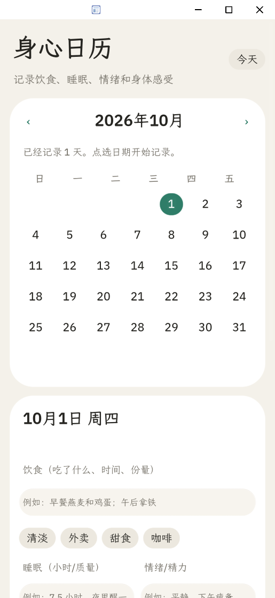
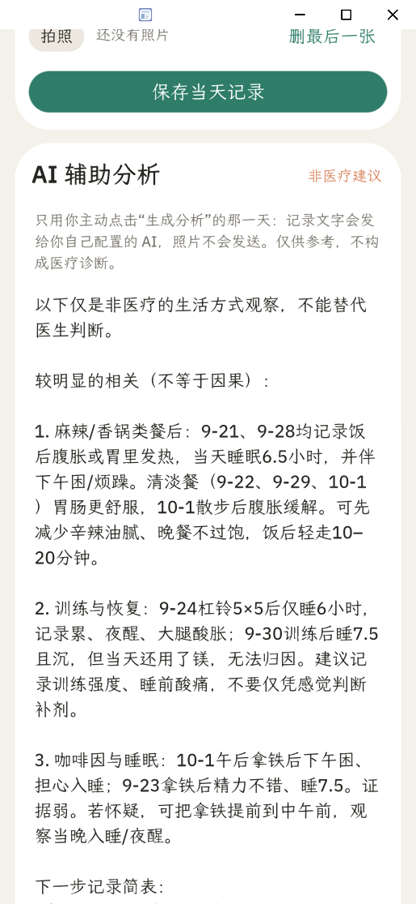
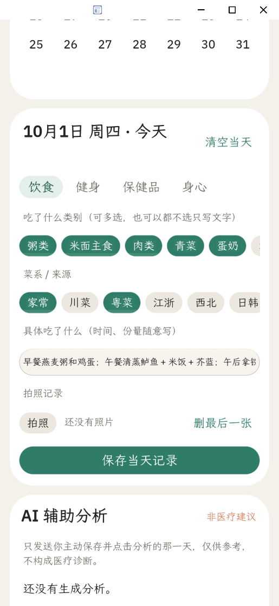
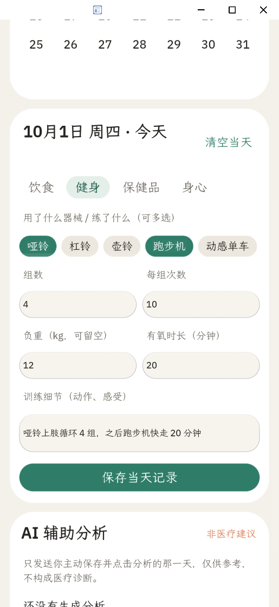
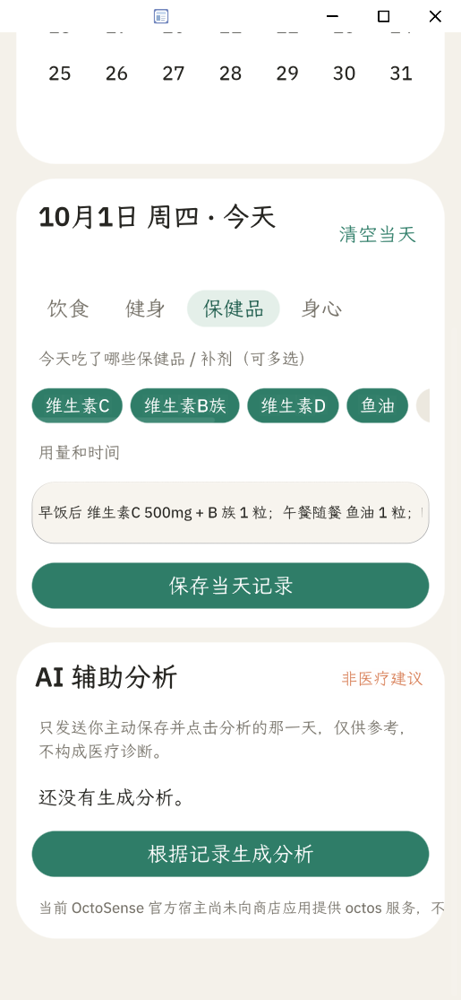
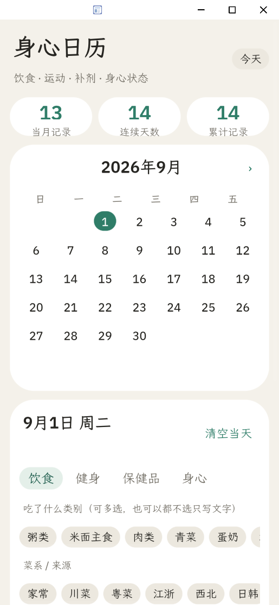
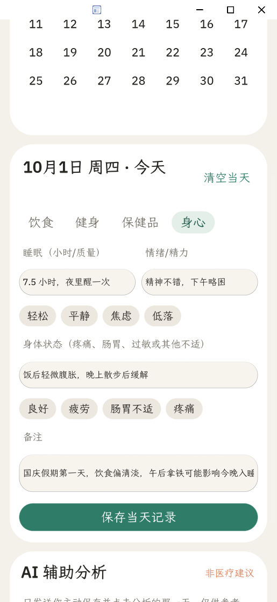
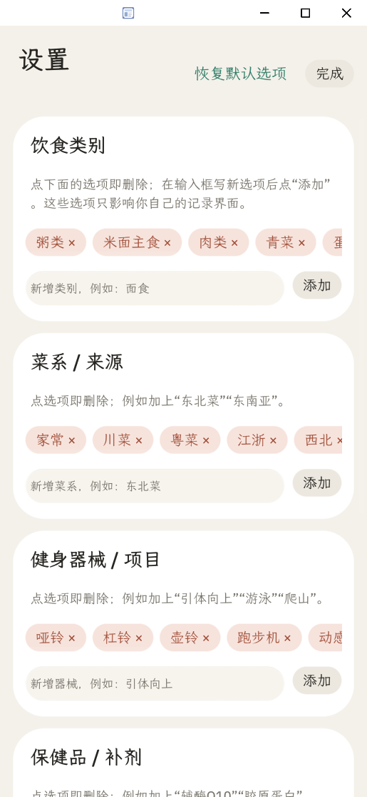

# 身心日历

**把每天的饮食、训练、补剂与身心感受放回时间线上，让记录可回看，让 AI 的观察有依据。**

[Agent2App Hackathon 2026](https://github.com/gosimfoundation/hackathon-agenticapp26) 参赛作品 · OctoSense Script App · v0.3.0 · Apache-2.0

<p align="center">
  
  
</p>
<p align="center"><sub>Windows card-host 实际运行截图：月历记录与真实模型分析。截图使用模拟的个人健康数据。</sub></p>

[设计思路](#设计思路) · [功能与界面](#功能与界面) · [AI 分析](#ai-辅助分析) · [运行与验证](#运行与验证) · [移动端与发布](#移动端与发布)

## 作品概览

很多健康记录工具让人先填一份完整表单，回头却很难回答「这几天吃了什么、练了什么、感觉有什么变化」。身心日历把**日期作为主索引**：随手记下当天有价值的片段，在月历中找到它们，再由用户主动发起跨日期的 AI 辅助分析。

一次典型使用：选中日期 → 勾选吃过的类别、训练项目或补剂，补充睡眠与身体感受 → 回看前后几天 → 点击「根据记录生成分析」，得到带不确定性提示的观察与下一步记录建议。**记录不依赖 AI；AI 不代替诊断。**

| 已实现 | 当前边界 |
| --- | --- |
| 月历回看；饮食、健身、保健品、身心记录；自定义选项；本地持久化；主动触发的真实 AI 分析 | Windows `card-host` 已验证；Windows 相机宿主不可用；手机与其他桌面平台尚未实测 |

## 设计思路

| 设计选择 | 为什么这样做 |
| --- | --- |
| **以日历组织，而非以问卷组织** | 月历标出有记录的日期，并显示当月记录、连续天数和累计记录；翻月、选日即可把零散事件放回时间顺序。 |
| **所有字段可选** | 饮食、健身、保健品、身心分成四个标签页。只记一顿饭或一次不适也成立，不要求每天完成整套表单。切换日期前会保存当天编辑。 |
| **预设选项 + 自由文字 + 个人配置** | 常见类别、菜系、器械和补剂可点选；细节仍可自由描述。设置页可增删选项，历史记录不会因删掉选项而消失。 |
| **本地优先、分析需授权** | 日常记录与照片留在应用隔离存储；只有主动点击分析才发送文字，照片不发送。AI 失败不影响记录和回看。 |
| **把相关性与因果分开** | 模型只负责整理线索与建议继续观察的变量，不宣称找到病因，不给医疗诊断。 |

## 功能与界面

| 模块 | 可以记录什么 |
| --- | --- |
| **月历** | 前后翻月、回到今天、查看有记录的日期和三项记录统计。 |
| **饮食** | 粥类、主食、肉类、青菜等类别；家常、川菜、粤菜等菜系/来源；自由文字；可选拍照、查看与删除照片。 |
| **健身** | 哑铃、杠铃、跑步机、瑜伽垫等项目；组数、每组次数、负重、有氧时长和训练感受。 |
| **保健品** | 维生素 C、B 族、鱼油等多选，用文字补充剂量与服用时间。 |
| **身心** | 睡眠时长与质量、情绪/精力、身体感受和备注，附常用快捷标签。 |
| **设置** | 增删饮食类别、菜系/来源、健身项目和保健品；可恢复默认选项而不清除已有日历记录。 |

<p align="center">
  
  
  
</p>
<p align="center"><sub>从左到右：饮食、健身、保健品。所有选项和数值均可留空。</sub></p>

<p align="center">
  
  
  
</p>
<p align="center"><sub>从左到右：历史月份、身心状态、自定义选项。</sub></p>

> 截图来自 Windows `card-host`，内容为演示用的模拟数据。拍照入口已实现，但 Windows 宿主没有相机后端，因此该平台会显示明确的不可用提示；真机拍照尚未验证。

## AI 辅助分析

用户点击「根据记录生成分析」后，应用发送**所选日期与最多 20 条历史记录的文字**，请模型寻找饮食、睡眠、情绪、训练和补剂之间值得观察的关联。分析结果保存在该日期的记录里，之后可以回看；照片不在请求中。优先使用本机配置导入的火山方舟 Responses API 凭据；未配置时尝试 OctoSense 宿主助手。

以 2026-10-01 的**模拟记录**为例，真实方舟模型分析提到：两次辛辣餐后都记录了腹部不适；训练后的疲劳同时伴有睡眠不足，不能直接归因于训练或某种补剂；午后咖啡与睡眠的关系证据较弱。建议继续记录症状出现时间、咖啡因时间、睡眠与训练强度。这展示的是**整理线索、提出可继续观察的问题**，不是医学结论；完整界面见上方 AI 截图。

- 提示词要求模型不下诊断、不虚构确定病因；遇到胸痛、呼吸困难、意识异常、自伤想法或持续加重等情况，提醒及时就医。
- 记录文字作为数据提供给模型，不应被当作指令执行。
- 请求失败或宿主助手不可用时，界面显示原因，本地记录仍可正常使用。

**本应用不提供医疗诊断、治疗或用药建议。**

## 实现与数据

这个仓库的应用本体是 [`bundle/`](bundle/)：[`main.splash`](bundle/main.splash) 实现界面和交互，[`manifest.json`](bundle/manifest.json) 声明 `storage`、`camera`、`net` 与宿主助手能力，并将网络访问限定到方舟 HTTPS 主机；[`listing.json`](bundle/listing.json) 提供商店信息和截图。

- 日历记录写入应用隔离存储的 `health_calendar.json`；自定义选项、模型名和可选凭据写入 `settings.json`；照片写入同一隔离目录的 `DCIM/`。
- 不要求登录，不在后台自动上传记录。导入的 AI Key 不进入仓库或截图，但隔离目录中的配置文件是**明文**，须按本机敏感文件管理。
- 完整数据说明见 [隐私说明](PRIVACY.md)。

## 运行与验证

### 已验证范围

| 项目 | 结果 |
| --- | --- |
| Windows `card-host` | 月历、记录、设置、本地存储和界面截图已在实际宿主运行。 |
| AI | 使用本机导入的火山方舟凭据实际生成过分析；无配置或服务失败时显示错误。 |
| Bundle 准入 | 已通过 OctoSense Hub 的 `check`；修改 `bundle/` 后需重新执行检查并更新完整性戳。 |
| 相机 / 手机 | Windows 相机后端不可用；Android、iOS、macOS、Linux 和真机未实测。 |

### 在 Windows 启动

按 [OctoScript-App-Design-Flow 快速上手](https://github.com/OctoSense-org/OctoScript-App-Design-Flow/blob/main/docs/QUICKSTART.md) 准备相邻仓库：

```text
<workspace>/
  OctoScript-App-Design-Flow/
  OctoSense-App-Hub/
  makepad/
  octoscript/
  octoscript-makepad/
  apps/octosense-app/       # 本仓库
```

先编译一次宿主；未修改宿主 Rust 代码时不必重复：

```powershell
cd <workspace>\OctoSense-App-Hub
cargo build --release -p octosense-card-host -p octosense-app-hub
```

随后在本仓库运行：

```powershell
cd <workspace>\apps\octosense-app
.\run.ps1                 # 打开可见窗口
.\run.ps1 -Check          # Hub 准入检查
.\run.ps1 -Port 8155      # 默认端口 8154 被占用时
```

PowerShell 禁止执行脚本时可运行 `powershell -ExecutionPolicy Bypass -File .\run.ps1`。[`run.ps1`](run.ps1) 会自动定位同一 workspace 中的 `octo`、`hub.exe` 和 `card-host.exe`。

### 配置自己的 AI

```powershell
# 可先设置 ARK_API_KEY；已有受支持的方舟 Agent Plan Codex 配置时也可直接导入
.\configure-ai.ps1
# 关闭并重启 App，在有文字记录的日期点击「根据记录生成分析」
```

[`configure-ai.ps1`](configure-ai.ps1) 优先读取 `ARK_API_KEY`，否则尝试读取本机 Codex 配置中的方舟 Agent Plan 凭据；`ARK_MODEL` 可覆盖模型名。运行 `.\configure-ai.ps1 -Clear` 清除导入凭据。配置写在被 Git 忽略的 `.local-state/health-calendar/settings.json` 中，不要提交它。当前脚本只接受公开的方舟 HTTPS 接口；本地 HTTP 网关不能直接用于此 bundle。

如需手动检查、截图或关闭实例，可使用 `OctoScript-App-Design-Flow/tools/octo` 的 `check`、`shot` 命令，以及宿主的 `/quit` 端点。仓库中的 `.gitattributes` 保证 `bundle/` 不发生行尾转换；`main.splash` 的完整性按字节校验。

## 移动端与发布

**本仓库是 OctoSense bundle，不是独立 APK。** APK 属于运行 bundle 的 OctoSense 宿主；不能直接把本仓库单独编译为 APK。官方分发路径是按 [发布文档](https://github.com/OctoSense-org/OctoScript-App-Design-Flow/blob/main/docs/PUBLISHING.md) 签名并提交 catalog，签名和最终提交需要发布者本人完成。当前仓库尚未完成发布者签名或手机端验证。

如需自建 APK，必须另行构建完整的 OctoSense Android 宿主并把 bundle 登记为系统应用，依赖 Android SDK/NDK；官方手机商店当前不支持任意 bundle 侧载。此路径未在本项目验证。
